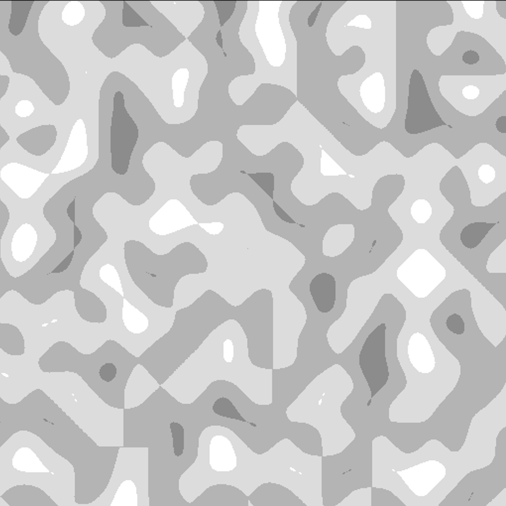

# AggmDiffusion-lite
A simple image generation tool that uses PIL, threading, tkinter, and numpy.
This python script can run on almost any machine! 

### Image examples:

> " A cloudy ocean "

> " A forest "

> " A volcanic land "
> 

